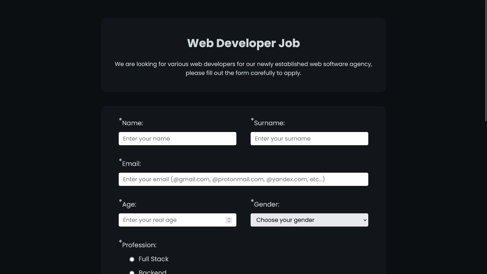

# Example-Job-Form

**_Example Job Form_**

## Technologies

-   **Html**
-   **Css**

## Dependencies

-   **Google Fonts(Poppins)**

#### _Note:_ _I did this work to get the freeCodeCamp Responsive Web Design certificate._
